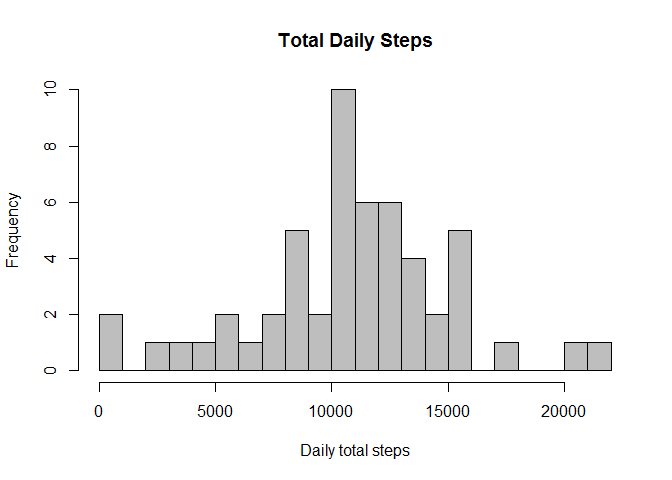
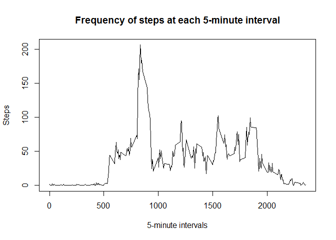
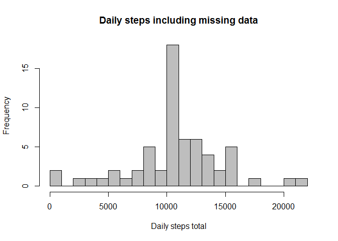

# Reproducible Research: Peer Assessment 1


##Loading and preprocessing the data

Download the data and set it up in the activity variable

```r
Sys.setlocale("LC_TIME", "C")
```

```
## [1] "C"
```

```r
url <- "https://d396qusza40orc.cloudfront.net/repdata%2Fdata%2Factivity.zip"
file <- "step_data.zip"
download.file(url, file)
unzip(file)
activity <- read.csv("activity.csv", sep = ",")
```

Convert date field from factor to date

```r
activity$date <- as.Date(activity$date)
```

Then clean the data to get rid of NAs

```r
activity_clean <- subset(activity, !is.na(activity$steps))
```

##What is mean total number of steps taken per day?

Create daily steps per day 

```r
dailysum <- tapply(activity_clean$steps, activity_clean$date, sum, na.rm=TRUE, simplify=T)
dailysum <- dailysum[!is.na(dailysum)]
```

Create histogram of total steps per day

```r
hist(x=dailysum,
     col="gray",
     breaks=20,
     xlab="Daily total steps",
     ylab="Frequency",
     main="Total Daily Steps")
```

<!-- -->

Mean and median of daily steps per day

```r
dailymean <-- mean(dailysum)
dailymedian <-- median(dailysum)
dailymean
```

```
## [1] -10766.19
```

```r
dailymedian
```

```
## [1] -10765
```

The mean is 10766 steps.
The median is 10765 steps.


## What is the average daily activity pattern?

Create a time series plot (i.e. type = "l") of the 5-minute interval (x-axis) and the average number of steps taken, averaged across all days (y-axis)

```r
averagedaily <- tapply(activity_clean$steps, activity_clean$interval, mean, na.rm=TRUE, simplify=T)
intervalaverage <- data.frame(interval=as.integer(names(averagedaily)), avg=averagedaily)

with(intervalaverage,
     plot(interval,
          avg,
          type="l",
          xlab="5-minute intervals",
          ylab="Steps",
          main="Frequency of steps at each 5-minute interval"))
```

<!-- -->

Which 5-minute interval, on average across all the days in the dataset, contains the maximum number of steps?

```r
max_steps <- max(intervalaverage$avg)
intervalaverage[intervalaverage$avg == max_steps, ]
```

```
##     interval      avg
## 835      835 206.1698
```

Interval 835 has the maximum number of steps at 206.2.

# Imputing missing values

Calculate and report the total number of missing values in the dataset (i.e. the total number of rows with NAs)

```r
sum(is.na(activity$steps))
```

```
## [1] 2304
```
There are 2304 NAs

Strategy: If a 5-minute interval has missing value, we use the mean for that entire 5-minute interval.

Fill in the missing data

```r
activity_fill <- activity
ndx <- is.na(activity_fill$steps)
int_avg <- tapply(activity_clean$steps, activity_clean$interval, mean, na.rm=TRUE, simplify=T)
activity_fill$steps[ndx] <- int_avg[as.character(activity_fill$interval[ndx])]
```

Plot the missing data

```r
new_dailysum <- tapply(activity_fill$steps, activity_fill$date, sum, na.rm=TRUE, simplify=T)

hist(x=new_dailysum,
     col="gray",
     breaks=20,
     xlab="Daily steps total",
     ylab="Frequency",
     main="Daily steps including missing data")
```

<!-- -->

Mean and median of daily steps per day

```r
mean(new_dailysum)
```

```
## [1] 10766.19
```

```r
median(new_dailysum)
```

```
## [1] 10766.19
```

The mean and median are both 10766.19 steps. These values do not differ much from the first part of the assignment. However, the impact of of imputing missing data is that there are a lot more values at exactly the new mean, which also gives us the new median. These are the results of imputing new data.

##Are there differences in activity patterns between weekdays and weekends?

Create a new factor variable in the dataset with two levels – “weekday” and “weekend” indicating whether a given date is a weekday or weekend day

```r
is_weekday <- function(d) {
    wd <- weekdays(d)
    ifelse (wd == "Saturday" | wd == "Sunday", "weekend", "weekday")
}

wx <- sapply(activity_fill$date, is_weekday)
activity_fill$wk <- as.factor(wx)
head(activity_fill)
```

```
##       steps       date interval      wk
## 1 1.7169811 2012-10-01        0 weekday
## 2 0.3396226 2012-10-01        5 weekday
## 3 0.1320755 2012-10-01       10 weekday
## 4 0.1509434 2012-10-01       15 weekday
## 5 0.0754717 2012-10-01       20 weekday
## 6 2.0943396 2012-10-01       25 weekday
```

Make a panel plot containing a time series plot (i.e. type = "l") of the 5-minute interval (x-axis) and the average number of steps taken, averaged across all weekday days or weekend days (y-axis).

```r
wk_df <- aggregate(steps ~ wk+interval, data=activity_fill, FUN=mean)

library(lattice)
xyplot(steps ~ interval | factor(wk),
       layout = c(1, 2),
       xlab="Interval",
       ylab="Number of steps",
       type="l",
       lty=1,
       data=wk_df)
```

<!-- -->
Are there differences in activity patterns between weekdays and weekends? Yes, as it seems like the participant gets up earlier in the weekday and later in the weekend. In addition, likely the particpant is at work during the weekday, so the activity levels are lower then.
